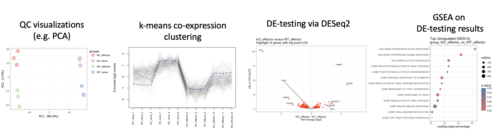

# BulkRNAseqAnalysis_from_countMatrix
This repository centers around an R Markdown program/script to perform standard bioinformatic analysis steps for RNA-seq raw count matrices and ultimately compile the results to a html or pdf report.  Analysis steps include: Adding biomaRt annotation based on Ensembl gene IDs, filtering and QC, normalization, visual overview (PCA, heatmaps), k-means clustering + ORA (overrepresentation analysis), differential expression testing via DESeq2 + subsequent enrichment testing via GSEA (gene set enrichment analysis), and finally dataframe export as text file as well as the generation of an html analysis report.
A full example analysis report is available as "ExampleAnalysisReport_Demo.html" (or alternatively "ExampleAnalysisReport_Demo.pdf" which comes without the interactive plots), which is obtained by running the script on a demo dataset ("DemoDataset.txt"). Here are a few snapshots:




## Contents


- **BulkRNAseqAnalysis_from_CountMatrix.Rmd** : R markdown script that performs the analysis based on specified input parameters (see code section "Chosen Parameters" in the Rmd file). Knit to html to obtain an html report of your analysis. The current parameter configuration is set to fully support the demo dataset (see below). 

- **functions.R** : Functions required for the script (sourced automatically if located in the same folder).

- **DemoDataset.txt** : A raw count matrix that serves as the demo dataset so that anyone can explore the script. The parameters in BulkRNAseqAnalysis_from_CountMatrix.Rmd are already set to support the entire analysis of this dataset.

- **ExampleAnalysisReport_Demo.html** : The analysis report that is generated when running the script on the demo dataset. Check it out!

- **ExampleAnalysisReport_Demo.pdf** : The exact same analysis report but as pdf file, and therefore without the interactive plots. 


## Required Data Input 

- A tab-separated raw read count matrix  with rows corresponding to individual genes. The table is required to contain the following columns: a) a separate column of read counts for each unique sample, and b) a column containing  Ensembl gene IDs.


## Data Output

- An interactive html report created when knitting the BulkRNAseqAnalysis_from_CountMatrix.Rmd file to  html file (see "ExampleAnalysisReport_Demo.html" or "ExampleAnalysisReport_Demo.pdf" as an example).
- Various figures and output tables that are generated when running the script. For more info, refer to the html report.


## Acknowledgements

- The demo dataset was kindly provided by Lisa Sandner and Nicole Boucheron from the Institute of Immunology (IFI), Medical University of Vienna. The data is from a bulk RNAseq experiment of Rinl KO vs WT in naive and effector CD4+ T-cells, and has been published as part of a larger project (PMID: 37703004).


## Session Info

```
R version 4.3.2 (2023-10-31)
Platform: x86_64-apple-darwin20 (64-bit)
Running under: macOS Big Sur 11.7.10

Matrix products: default
BLAS:   /System/Library/Frameworks/Accelerate.framework/Versions/A/Frameworks/vecLib.framework/Versions/A/libBLAS.dylib 
LAPACK: /Library/Frameworks/R.framework/Versions/4.3-x86_64/Resources/lib/libRlapack.dylib;  LAPACK version 3.11.0

locale:
[1] en_US.UTF-8/en_US.UTF-8/en_US.UTF-8/C/en_US.UTF-8/en_US.UTF-8

time zone: Europe/Vienna
tzcode source: internal

attached base packages:
[1] stats4    stats     graphics  grDevices utils     datasets  methods   base     

other attached packages:
 [1] enrichplot_1.22.0           viridis_0.6.4               viridisLite_0.4.2           clusterProfiler_4.10.0     
 [5] msigdbr_7.5.1               cowplot_1.1.1               ggrepel_0.9.4               ashr_2.2-63                
 [9] gplots_3.1.3                reshape2_1.4.4              plotly_4.10.4               rlist_0.4.6.2              
[13] gprofiler2_0.2.2            dendextend_1.17.1           RColorBrewer_1.1-3          lubridate_1.9.3            
[17] forcats_1.0.0               stringr_1.5.0               dplyr_1.1.4                 purrr_1.0.2                
[21] readr_2.1.4                 tidyr_1.3.0                 tibble_3.2.1                ggplot2_3.5.0              
[25] tidyverse_2.0.0             DESeq2_1.42.0               SummarizedExperiment_1.32.0 Biobase_2.62.0             
[29] MatrixGenerics_1.14.0       matrixStats_1.1.0           GenomicRanges_1.54.1        GenomeInfoDb_1.38.0        
[33] IRanges_2.36.0              S4Vectors_0.40.1            BiocGenerics_0.48.1         biomaRt_2.58.0      
```


